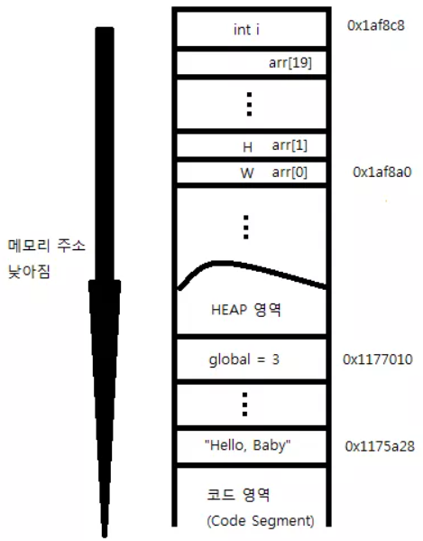

# 스택보다 힙이 느리게 할당되는 이유

### 스택

- **Stack Frame 단위**(고정 단위)로 allocation/disallocation이 되고,
- 기본적으로 파편화 되지 않게끔 **꽉 채워서 사용**하므로, (컴파일러마다 다름)
- 마지막 주소만 알면 되니까 **alloc/disalloc이 빠르다.**
- **메모리 크기도 컴파일 타임에 결정**되어 빠르다.
- 참고
    - 높은 주소부터 탑다운 순서
    - **너무 큰 사이즈**의 배열은 stack limit을 넘어갈 수 있음 → **Stack Overflow** → 프로그램 멈춤

### 힙

- 파편화되어 할당되므로, **중간에 어느 곳이 비었는지 확인**해야함.
- 할당할 **메모리 크기를 런타임에 알** 수 있음.
- 멀티스레드 환경: race condition을 없애기 위해서 더 복잡한 방식으로 할당

## 스택/힙 적절하게 선택하는 방법

성능 크리티컬한 것은, 일정한 크기(고정 크기)까지는 힙이 아닌 최대한 스택에 쌓도록 하고, 그 이상은 힙에!

(할당 속도 차이 때문)

```cpp
#include <array>
#include <vector>
#include <iostream>

using namespace std;
class Cat
{

};
void foo(int num)
{
    vector<Cat> cats(num);

    // do some computation over cats
}
bool bar(int num)
{
    constexpr int maxCats = 1000;
    if(maxCats < num)
    {
        return false;
    }
    array<Cat, maxCats> cats;
    // do some computation over cats
}
int main(void)
{
    int count;
    cin >> count;
    // if we need performance critical cats -> alloc in STACK
    for(int i=0; i<10000; ++i)
    {
        //foo(count);   // heap (vector)
        bar(count);     // STACK (array)
    }
}
```

# 메모리 구조 (참고)

- C언어 실행 자체적으로는 스택과 힙을 구분하지 않지만, 대부분의 운영체제가 위의 구조.
- 예시
    
    ```cpp
    /* 메모리의 배치 모습 */
    
    #include <stdio.h>
    int global = 3;
    int main() {
      int i;
      char *str = "Hello, Baby";
      char arr[20] = "WHATTHEHECK";
    
      printf("global : %p \n", &global);
      printf("i : %p \n", &i);
      printf("str : %p \n", str);
      printf("arr : %p \n", arr);
    }
    ```
    
    